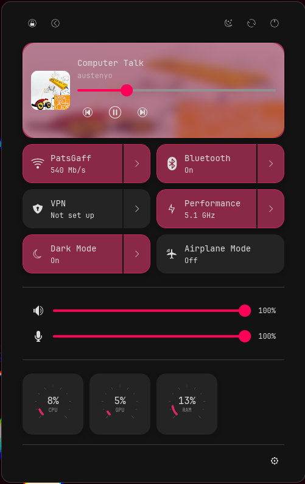
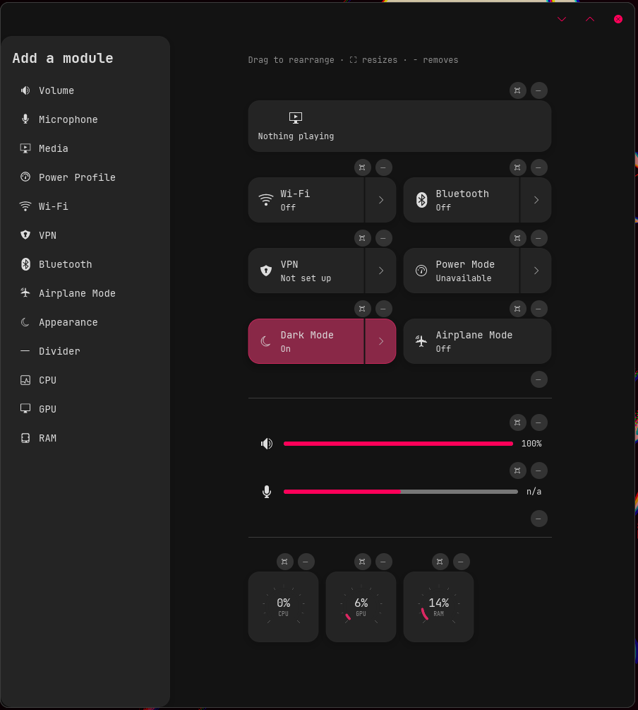

# cosmic-control-center

A modular control center for the [COSMIC](https://system76.com/cosmic) desktop.

You arrange the module tiles you want (Wi-Fi, volume, media, power profile,
gauges, and so on) in an editor window. A panel applet then shows that same
layout in a popup, where the tiles are live and interactive. If a tile you want
isn't built in, you can add one with a small RON plugin file that runs shell
commands, without writing Rust or recompiling.

Status: early preview (0.1.1). It works and is usable day to day, but it still
has rough edges. See [Known issues](#known-issues).

<p align="center">
  
  
</p>

On the left, the applet popup with live, interactive tiles. On the right, the
editor window where you add, remove, reorder, and resize tiles from the palette.

## Two pieces

| Binary | What it is |
|---|---|
| `cosmic-control-center` | The editor window. Add, remove, reorder, and resize tiles. Saves the layout to `cosmic-config`. |
| `cosmic-control-center-applet` | The panel applet. A popup that shows your configured tiles, live and interactive. Its gear button opens the editor. |

## Modules

Volume, Microphone, Media (MPRIS), Wi-Fi (SSID and link rate), VPN, Bluetooth,
Airplane mode, Power profile, Appearance (light/dark), CPU/GPU/RAM/Disk gauges,
a combined system monitor, battery readout, section divider, and session/power
actions (lock, sleep, log out, restart, shut down).

## Install

### Arch (AUR)

```sh
paru -S cosmic-control-center        # or your preferred AUR helper
```

### Debian and Fedora (prebuilt)

Download the `.deb` or `.rpm` from the
[latest release](https://github.com/Pyxyll/cosmic-control-center/releases/latest)
and install it with your package manager. A static-binary `.tar.gz` is also
attached for other distributions.

### From source

Needs the Rust toolchain and [`just`](https://github.com/casey/just).

```sh
git clone https://github.com/Pyxyll/cosmic-control-center
cd cosmic-control-center
sudo just install                    # builds release and installs to /usr
```

Uninstall with `sudo just uninstall`.

### Add the applet to your panel

In a COSMIC session, go to Settings > Desktop > Panel (or Dock) > Add applet >
Control Center. Click the panel icon to open the popup. The gear opens the
editor, which also shows up in your app launcher as "Control Center".

## Plugins

A plugin is a single `.ron` file in `~/.config/cosmic-control-center/plugins/`.
It describes a tile and a list of controls, each bound to shell commands:

```ron
Manifest(
  id: "demo.echo", name: "Echo Demo", icon: "utilities-terminal-symbolic", size: Large,
  controls: [
    Label(id:"clock", label:"Clock", get: Cmd("date +%H:%M:%S"), poll: 1.0),
    Slider(id:"level", label:"Level", min:0.0, max:100.0,
           set: Cmd("echo level={value} >> /tmp/ccc-demo.log")),
    Toggle(id:"flag", label:"Flag", set: Cmd("notify-send 'Echo Demo' 'flag = {value}'")),
    Button(id:"ping", label:"Ping", run: Cmd("notify-send 'Echo Demo' 'ping'")),
  ],
)
```

The control types are `Slider`, `Toggle`, `Label`, and `Button`. `get` reads
state, `set` and `run` act (with `{value}` substituted), and `poll` (in seconds)
re-reads `get`. The manifest above is [`examples/echo-demo.ron`](examples/echo-demo.ron):
drop it into the plugins directory and add it from the editor to see all four
control types working.

Security note: plugin commands run with your privileges via `sh -c`. Only
install manifests you trust, the same as you would a shell script or an AUR
helper.

## Known issues

The applet refreshes module state on a 2 second poll while the popup is open.
Those queries are still synchronous, so a slow one (for example
`bluetoothctl`) can briefly stutter the UI. Moving the refresh off the UI thread
is planned.

The plugin system is functional but experimental. For now it only supports
`Cmd` actions and basic styling. D-Bus and HTTP actions, plus native-looking
plugin tiles, are planned.

Tile resizing is uneven. Not every module lays out cleanly at every column
width, so some tiles look cramped or clip their contents at certain sizes.
Per-module layout across the size range still needs work.

The media player comes in two styles, each a separate palette entry: "Media"
follows the COSMIC design system (a plain card) and is the default, while
"Media (album art)" uses the custom blurred album-art backdrop.

## Built with

[libcosmic](https://github.com/pop-os/libcosmic), which is MPL-2.0. This project
is [MIT](LICENSE). Bundled and linked dependencies keep their own licenses:
libcosmic and its iced fork are MPL-2.0; `zbus`, `image`, `serde`, and `ron` are
MIT or Apache-2.0.
